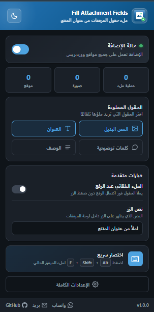
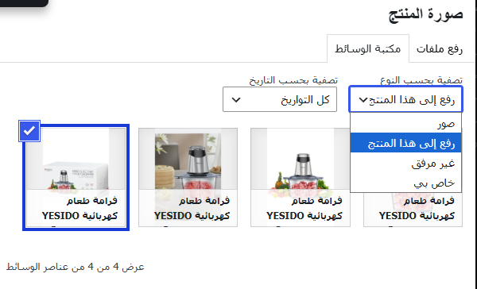
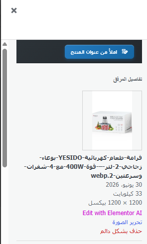
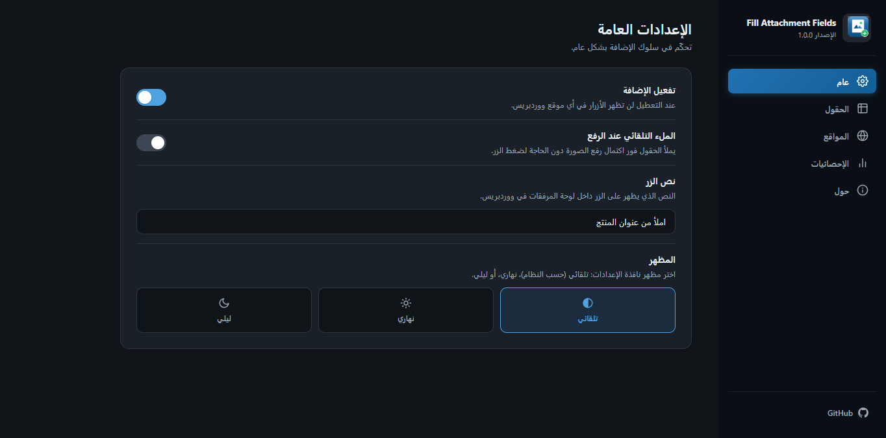
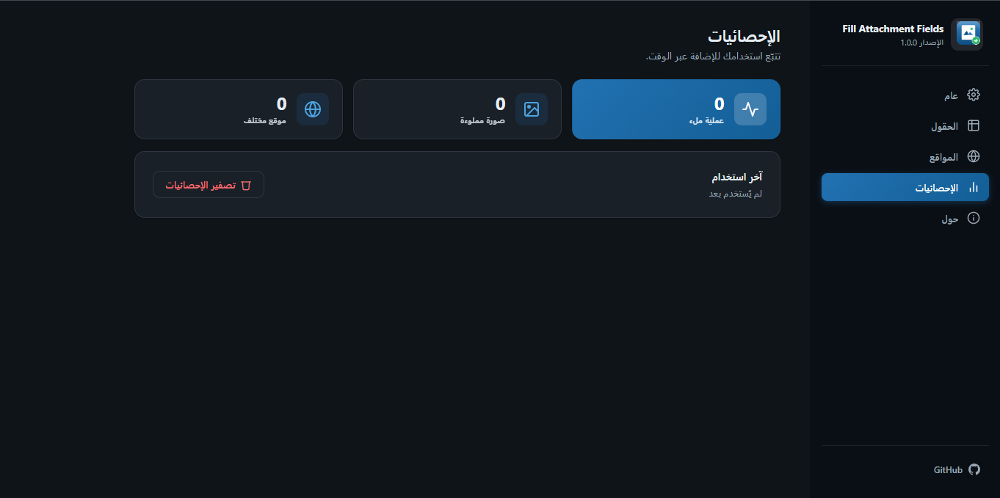

# Fill Attachment Fields — Universal WordPress Extension

> ⚡ املأ حقول صور المنتجات في ووردبريس بضغطة واحدة — على أي موقع، بدون تعقيد.

<div align="center">

[](https://github.com/yousef2000326/Fill-Attachment-Fields-Universal-WordPress-Extension/releases/tag/1.0.0)
[](LICENSE)
[](https://chrome.google.com/webstore/detail/fill-attachment-fields)
[](https://developer.chrome.com/docs/extensions/mv3/intro/)

</div>

<div dir="rtl">

إضافة كروم احترافية (Manifest V3) تضيف زرًا بعنوان **«املأ من عنوان المنتج»** داخل لوحة تفاصيل المرفق في مكتبة وسائط ووردبريس. عند الضغط على الزر (أو استخدام الاختصار `Alt+Shift+F`)، يتم نسخ عنوان المنتج الحالي إلى حقول المرفق المختارة — مما يوفر وقتك عند رفع صور المنتجات ويحسّن SEO في نفس الوقت.

<div align="center">

### 🎬 شاهد الإضافة أثناء العمل

[](https://youtu.be/WEMcsqZtiYE)

</div>

---

<div dir="rtl">

**تجربة حية على متجر عقيق** — شاهد كيف تعمل الإضافة في الواقع: من رفع صور المنتج إلى ملء الحقول بضغطة واحدة.

<iframe width="100%" height="400" src="https://www.youtube.com/embed/WEMcsqZtiYE" title="Fill Attachment Fields — تجربة على متجر عقيق" frameborder="0" allow="accelerometer; autoplay; clipboard-write; encrypted-media; gyroscope; picture-in-picture" allowfullscreen></iframe>

</div>

---

<div align="center">



</div>

---

## 📑 فهرس المحتوى

- [المميزات](#-المميزات)
- [لقطات الشاشة](#-لقطات-الشاشة)
- [التثبيت](#%EF%B8%8F-التثبيت-على-كروم)
- [الاستخدام](#-الاستخدام-السرعة)
- [الإعدادات](#%EF%B8%8F-الإعدادات)
- [اختصارات لوحة المفاتيح](#%EF%B8%8F-اختصارات-لوحة-المفاتيح)
- [كيف تعمل؟](#%EF%B8%8F-كيف-تعمل-الإضافة)
- [هيكل المشروع](#%EF%B8%8F-هيكل-المشروع)
- [الخصوصية](#%EF%B8%8F-الخصوصية)
- [التوافق](#%EF%B8%8F-التوافق)
- [المطوّر](#%EF%B8%8F-%D9%85%D9%8A%D8%AF)
- [المساهمة](#%EF%B8%8F-المساهمة)
- [الترخيص](#%EF%B8%8F-الترخيص)
- [سجل التغييرات](#%EF%B8%8F-سجل-التغييرات)

---

## ✅ المميزات

| الميزة | الوصف |
|--------|-------|
| 🌍 **أي موقع ووردبريس** | يعمل تلقائيًا على أي موقع — جذر النطاق أو مجلد فرعي — بدون إعدادات مسبقة |
| 🎛️ **تحكم كامل بالحقول** | اختر الحقول: النص البديل / العنوان / كلمات توضيحية / الوصف |
| ⚡ **ملء تلقائي** | فعّل الملء التلقائي عند الرفع — الحقول تُملأ فورًا بدون ضغط الزر |
| ✏️ **نص زر مخصص** | غيّر نص الزر إلى أي شيء تريده |
| 🎨 **تصميم احترافي** | نافذة منبثقة عصرية + صفحة إعدادات كاملة بتبويبات منظمة |
| 🌙 **وضع ليلي** | تلقائي حسب النظام أو يدوي — نهاري / ليلي |
| ⌨️ **اختصارات سريعة** | `Alt+Shift+F` للملء — `Alt+Shift+P` للإعدادات |
| 📊 **إحصائيات مفصّلة** | عمليات الملء، الصور، المواقع، آخر استخدام، ترتيب المواقع |
| 🚫 **قائمة حظر** | استثنِ مواقع محددة من عمل الإضافة |
| 🔒 **خصوصية تامة** | لا بيانات شخصية — كل شيء محفوظ محليًا |

---

## 📸 لقطات الشاشة

### النافذة المنبثقة

<div align="center">


</div>

### التدفق الكامل

<div align="center">

**الخطوة 1 — تصفية حسب النوع**


**الخطوة 2 — الزر فوق الصورة**


**الخطوة 3 — الحقول بعد الملء**


</div>

### صفحة الإعدادات

<div align="center">

**عام**


**الحقول**


**المواقع المحظورة**


**الإحصائيات**


**حول**


</div>

---

## 📦 التثبيت على كروم

### الطريقة 1: تحميل غير مضغوط (للتطوير)

```bash
git clone https://github.com/yousef2000326/Fill-Attachment-Fields-Universal-WordPress-Extension.git
```

1. افتح Chrome وانتقل إلى `chrome://extensions`
2. فعّل **Developer mode** من الزاوية العلوية
3. اضغط **Load unpacked** واختر مجلد `extension/`
4. ✅ ستظهر أيقونة الإضافة في شريط الأدوات

### الطريقة 2: من ملف ZIP (للتوزيع)

1. نزّل أحدث إصدار من صفحة [Releases](https://github.com/yousef2000326/Fill-Attachment-Fields-Universal-WordPress-Extension/releases)
2. فك ضغط الملف
3. اتبع الخطوات 1-4 أعلاه

> **💡 ملاحظة:** للتوزيع على العملاء، قم بعمل ZIP لمجلد `extension/` فقط — هذا هو كل ما يحتاجونه.

---

## 🚀 الاستخدام السريع

### في 6 خطوات بسيطة:

**① افتح المنتج** — ادخل على صفحة تحرير المنتج في لوحة تحكم ووردبريس.

**② ارفع الصور** — ارفع صور المنتج من مكتبة الوسائط أو من داخل صفحة المنتج.

**③ تصفية** — اختر «تصفية حسب النوع» ثم «رفع إلى هذا المنتج» لعرض صور هذا المنتج فقط.


**④ اختر الصورة** — اضغط على أي صورة لفتح لوحة تفاصيل المرفق.

**⑤ املأ الحقول** — اضغط زر «املأ من عنوان المنتج» فوق الصورة، أو استخدم `Alt+Shift+F`.


**⑥ تحقق** — الحقول المختارة مملوءة بعنوان المنتج تلقائيًا!


---

## ⚙️ الإعدادات

### النافذة المنبثقة (Popup)

اضغط على أيقونة الإضافة في شريط الأدوات:

- **حالة الإضافة** — تفعيل / تعطيل بضغطة واحدة
- **إحصائيات سريعة** — عمليات الملء · الصور · المواقع
- **الحقول** — اختر الحقول التي تريد ملؤها
- **خيارات متقدمة** — الملء التلقائي + نص الزر المخصص
- **روابط التواصل** — واتساب · بريد · GitHub


### صفحة الإعدادات الكاملة

افتح **«الإعدادات الكاملة»** للوصول إلى التبويبات التالية:

#### 🏠 عام


| الإعداد | الوصف |
|---------|-------|
| تفعيل الإضافة | تشغيل / إيقاف الإضافة بالكامل |
| الملء التلقائي | ملء الحقول تلقائيًا فور اكتمال رفع الصورة |
| المظهر | تلقائي (حسب النظام) / نهاري / ليلي |

#### 📋 الحقول


| الحقل | الأهمية |
|------|---------|
| **النص البديل (Alt Text)** | ⭐⭐⭐ مهم جدًا لـ SEO وإمكانية الوصول |
| **العنوان (Title)** | ⭐⭐ عنوان المرفق في ووردبريس |
| **كلمات توضيحية (Caption)** | ⭐ النص الظاهر أسفل الصورة |
| **الوصف (Description)** | ⭐ وصف تفصيلي للمرفق |

#### 🚫 المواقع المحظورة


- أضف نطاقات محددة لا تريد أن تعمل عليها الإضافة
- احذف مواقع من القائمة بسهولة

#### 📊 الإحصائيات


- عدد عمليات الملء الإجمالية
- عدد الصور المملوءة
- عدد المواقع المختلفة
- آخر وقت استخدام
- ترتيب المواقع الأكثر استخدامًا
- زر تصفير الإحصائيات

#### ℹ️ حول


- معلومات الإضافة والإصدار الحالي
- المميزات الرئيسية
- بيانات المطوّر وروابط التواصل
- رابط GitHub والإبلاغ عن مشكلة

---

## ⌨️ اختصارات لوحة المفاتيح

| الاختصار | الوظيفة |
|----------|---------|
| `Alt + Shift + F` | ملء حقول المرفق الحالي من عنوان المنتج |
| `Alt + Shift + P` | فتح النافذة المنبثقة للإعدادات السريعة |

> يمكنك تعديل الاختصارات من `chrome://extensions/shortcuts`

---

## 🔍 كيف تعمل الإضافة؟

```
فتح صفحة المنتج في ووردبريس
        │
        ▼
  content.js يُحقن تلقائيًا
        │
        ▼
  قراءة عنوان المنتج (#title)
        │
        ▼
  البحث عن لوحات المرفقات
  (.attachment-details.save-ready)
        │
        ▼
  إضافة الزر في أعلى كل لوحة
        │
        ▼
  عند الضغط → ملء الحقول المختارة
        │
        ▼
  إطلاق أحداث input/change/blur
  ليتعرف ووردبريس على التغييرات
        │
        ▼
  إرسال إحصائيات للـ Service Worker
        │
        ▼
  تحديث العدادات والشارة
```

**مراقبة DOM:** يستخدم `MutationObserver` مع `debounce` (200ms) لاكتشاف لوحات المرفقات الجديدة تلقائيًا — مثلًا عند رفع صور جديدة — وإضافة الزر لها فورًا.

---

## 📁 هيكل المشروع

```
Fill-Attachment-Fields-Universal-WordPress-Extension/
│
├── README.md              ← ملف التوثيق (هذا الملف)
├── CHANGELOG.md           ← سجل التغييرات
├── LICENSE                ← ترخيص MIT
├── .gitignore
│
├── images/                ← لقطات الشاشة
│   ├── popup-page.png
│   ├── filter-by-type.png
│   ├── button-above-image.png
│   ├── fields-filled.png
│   ├── general-settings.png
│   ├── attachment-fields.png
│   ├── blocked-sites.png
│   ├── statistics.png
│   └── about-extension.png
│
└── extension/             ← ملفات الإضافة (ZIP للتوزيع)
    ├── manifest.json      ← إعدادات الإضافة (Manifest V3)
    ├── background.js      ← Service Worker
    ├── content.js         ← سكريبت المحتوى
    ├── content.css        ← أنماط الزر
    ├── popup.html         ← النافذة المنبثقة
    ├── popup.css
    ├── popup.js
    ├── options.html       ← صفحة الإعدادات
    ├── options.css
    ├── options.js
    ├── _locales/          ← ملفات الترجمة (i18n)
    │   ├── ar/messages.json
    │   └── en/messages.json
    └── icons/             ← الأيقونات
        ├── icon16.png
        ├── icon48.png
        ├── icon128.png
        └── icon512.png
```

---

## 🔒 الخصوصية

| المبدأ | التفاصيل |
|--------|----------|
| 🚫 **لا جمع بيانات** | الإضافة لا تجمع أي بيانات شخصية |
| 💾 **إعدادات محلية** | محفوظة في `chrome.storage.sync` (تتزامن مع حسابك) |
| 📊 **إحصائيات محلية** | محفوظة في `chrome.storage.local` — لا تُرسل لأي خادم |
| 🌐 **لا طلبات خارجية** | لا توجد أي اتصالات شبكة خارجية |

---

## 🌐 التوافق

### المتصفحات

| المتصفح | الحالة |
|---------|--------|
| Google Chrome | ✅ مدعوم بالكامل (Manifest V3) |
| Microsoft Edge | ✅ مدعوم (Chromium) |
| Brave | ✅ مدعوم |
| Arc | ✅ مدعوم |
| Vivaldi | ✅ مدعوم |
| Opera | ✅ مدعوم |

### ووردبريس

- ✅ أي إصدار حديث يستخدم مكتبة الوسائط الحديثة
- ✅ يعمل مع WooCommerce وجميع قوالب ووردبريس

---

## 👨‍💻 المطوّر

<div align="right">

| | |
|---|---|
| **الاسم** | [Yousef Ahmed](https://wa.me/201148280146) |
| **البريد الإلكتروني** | [jolove2018go@gmail.com](mailto:jolove2018go@gmail.com) |
| **واتساب** | [+201148280146](https://wa.me/201148280146) |
| **GitHub** | [yousef2000326](https://github.com/yousef2000326) |

</div>

---

## 🤝 المساهمة

المساهمات مرحّب بها! إليك كيفية المساهمة:

1. **الإبلاغ عن مشكلة** — افتح [Issue](https://github.com/yousef2000326/Fill-Attachment-Fields-Universal-WordPress-Extension/issues) مع وصف واضح للمشكلة.
2. **اقتراح ميزة** — افتح [Issue](https://github.com/yousef2000326/Fill-Attachment-Fields-Universal-WordPress-Extension/issues) بوسم `enhancement`.
3. **المساهمة بالكود** — افتح [Pull Request](https://github.com/yousef2000326/Fill-Attachment-Fields-Universal-WordPress-Extension/pulls) مع شرح التغييرات.

---

## 📜 الترخيص

مرخّص تحت رخصة **MIT** — راجع ملف [LICENSE](LICENSE) للتفاصيل.

---

## 📝 سجل التغييرات

راجع ملف [CHANGELOG.md](CHANGELOG.md) للتفاصيل الكاملة عن كل إصدار.

</div>

---

<div align="center">

**صُنع بـ ❤️ لمجتمع ووردبريس العربي**

</div>

---

## English Summary

> A professional Chrome extension (Manifest V3) that adds a **"Fill from product title"** button to the WordPress media library attachment panel — works on **any WordPress site**.

### Quick Start

1. Install the extension from `extension/` folder
2. Open any WordPress product edit page
3. Upload product images
4. Filter by "Uploaded to this post"
5. Click an image → click **"Fill from product title"** button
6. Done! Fields are filled automatically

### Features

| Feature | Description |
|---------|-------------|
| 🌍 Universal | Works on any WordPress site — no configuration needed |
| 🎛️ Field Control | Choose which fields to fill: Alt Text, Title, Caption, Description |
| ⚡ Auto-Fill | Optional automatic filling on upload completion |
| 🎨 Professional UI | Modern popup + full settings page with tabs |
| 🌙 Dark Mode | Auto (system), Light, or Dark |
| ⌨️ Shortcuts | `Alt+Shift+F` to fill · `Alt+Shift+P` for popup |
| 📊 Statistics | Total fills, images, sites, last used, top sites |
| 🚫 Block List | Exclude specific sites |
| 🔒 Private | 100% local — no data collected |

### Developer

| | |
|---|---|
| **Name** | [Yousef Ahmed](https://wa.me/201148280146) |
| **Email** | [jolove2018go@gmail.com](mailto:jolove2018go@gmail.com) |
| **WhatsApp** | [+201148280146](https://wa.me/201148280146) |
| **GitHub** | [yousef2000326](https://github.com/yousef2000326) |

### License

MIT — see [LICENSE](LICENSE).
